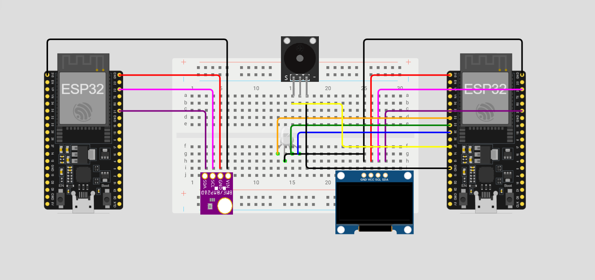

# IoT-System mit ESP32 – ESP-NOW, Sensorik, Webvisualisierung & Telegram Bot

## Temperatur- und Luftdruckmessung mit drahtloser Datenübertragung und Echtzeit-Visualisierung

**VerfasserInnen:** Marco Duong, Rumeysa Erkan  
**Datum:** 13.05.2026  

# 1. Einführung

Im Rahmen dieses Projekts wurde ein vollständiges IoT-System auf Basis von zwei ESP32 Mikrocontrollern entwickelt.

Ziel ist die Erfassung, drahtlose Übertragung und Visualisierung von Sensordaten in Echtzeit.

Dabei werden Temperatur- und Luftdruckwerte mithilfe eines BMP280 Sensors gemessen und über **ESP-NOW** an einen zweiten ESP32 übertragen.

Der Empfänger verarbeitet die Daten und stellt sie über mehrere Ausgabekanäle dar:

- Webserver mit Live-Daten
- Chart.js Graphen
- OLED Display
- RGB Status LED
- Buzzer Alarm
- Telegram Bot (PIR Meldung)

# 2. Systemaufbau

Das Projekt besteht aus zwei ESP32 Modulen:

## Sender (Sensor Node)
- BMP280 Sensor
- misst Temperatur & Luftdruck
- sendet Daten via ESP-NOW
- optional Deep Sleep für Energieeffizienz

## Empfänger (Control Node)
- empfängt ESP-NOW Daten
- verarbeitet & speichert Messwerte
- stellt Webserver bereit
- steuert OLED, RGB LED, Buzzer
- verarbeitet PIR + LDR Sensoren
- sendet Telegram Nachrichten

# 3. Projektziel

Ziel ist die Entwicklung eines stabilen IoT-Systems, das:

- Sensordaten zuverlässig erfasst
- drahtlos überträgt (ESP-NOW)
- mehrere Visualisierungsmöglichkeiten bietet
- Echtzeit-Überwachung ermöglicht  

Ein besonderer Fokus liegt auf:
- stabiler ESP-NOW Kommunikation
- sauberer Webvisualisierung
- modularer Erweiterbarkeit

# 4. Theorie

## 4.1 ESP32
Der ESP32 ist ein Mikrocontroller mit integrierter WLAN- und Bluetooth-Funktion und eignet sich ideal für IoT-Systeme.

## 4.2 BMP280 Sensor
Der BMP280 misst:
- Temperatur (°C)
- Luftdruck (hPa)

Kommunikation erfolgt über I2C.

## 4.3 ESP-NOW
ESP-NOW ist ein direktes Funkprotokoll zwischen ESP-Geräten ohne Router.

Vorteile:
- geringe Latenz
- kein WLAN-Netzwerk nötig
- stabile Peer-to-Peer Kommunikation

## 4.4 Webserver & Chart.js
Der ESP32 stellt einen Webserver bereit.

Die Daten werden:
- als JSON geliefert
- im Browser mit Chart.js visualisiert

## 4.5 OLED Display
Das OLED zeigt:
- aktuelle Temperatur
- aktuellen Luftdruck

## 4.6 Telegram Bot
Der Telegram Bot sendet Benachrichtigungen bei Bewegung (PIR Sensor).

# 5. Implementierung

## 5.1 Sensorintegration
BMP280 wurde am Sender-ESP32 integriert und erfolgreich getestet.

## 5.2 ESP-NOW Kommunikation
Die Kommunikation wurde stabil zwischen Sender und Empfänger implementiert.

Problem:
- unterschiedliche WLAN Kanäle führten zu Verbindungsfehlern

Lösung:
- fixer Kanal (11) auf beiden Geräten

## 5.3 Webserver & Graphen
Der Empfänger stellt zwei Graphen bereit:

- Temperatur Verlauf
- Luftdruck Verlauf

## 5.4 Erweiterungen (EK Features)
Zusätzlich wurden folgende Features implementiert:

- OLED Display
- RGB Status LED (Temperaturabhängig)
- Buzzer Alarm (>30°C)
- Telegram Bot (PIR Bewegung)
- LDR Helligkeitssensor

# 6. Testphase

Alle Komponenten wurden einzeln getestet:

- BMP280 liefert stabile Werte
- ESP-NOW Verbindung stabil
- Webserver aktualisiert live Daten
- Graphen zeigen korrekte Historie
- OLED zeigt aktuelle Werte
- RGB LED reagiert auf Temperatur
- Buzzer alarmiert bei Grenzwert
- Telegram Bot sendet PIR Meldungen  

# 7. Komponentenliste

| Komponente | Funktion |
|------------|----------|
| ESP32 (x2) | Steuerung & Kommunikation |
| BMP280 | Temperatur & Luftdruck |
| OLED SSD1306 | Lokale Anzeige |
| RGB LED | Statusanzeige |
| KY-006 Buzzer | Alarm |
| PIR Sensor | Bewegungserkennung |
| LDR Sensor | Helligkeit |
| WLAN | Webserver |
| ESP-NOW | Datenübertragung |
| Telegram Bot | Benachrichtigung |

# 8. Schaltungsplan

# 9. Code

Der vollständige Code ist im Repository enthalten:

## Sender
- BMP280 Messung
- ESP-NOW Übertragung
- Deep Sleep (optional)

## Receiver
- Webserver + Chart.js
- OLED Display
- RGB LED Steuerung
- Buzzer Alarm
- PIR + LDR Sensoren
- Telegram Bot Integration

# 10. Zusammenfassung

Das Projekt zeigt ein vollständiges IoT-System mit:

- drahtloser Kommunikation (ESP-NOW)
- Echtzeit Webvisualisierung
- Sensorintegration
- Aktorsteuerung (LED, Buzzer)
- Cloud Messaging (Telegram Bot)  

Die größte Herausforderung war die stabile ESP-NOW Kommunikation, welche durch Kanal-Synchronisation gelöst wurde.

# 📖 11. Quellen

[1] https://randomnerdtutorials.com/esp-now-esp32-arduino-ide/  
[2] https://www.chartjs.org/  
[3] https://core.telegram.org/bots/api  
[4] https://docs.espressif.com/
