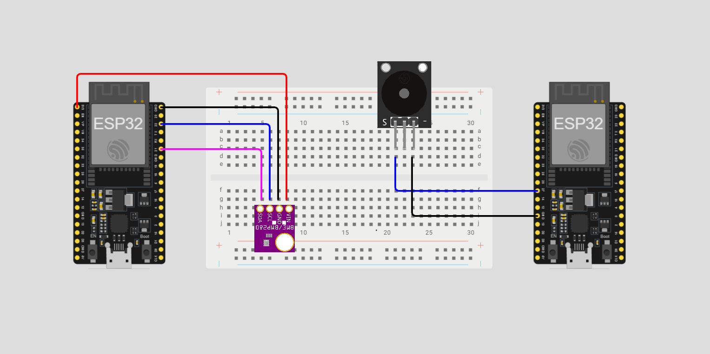

# IoT-System mit ESP32 – ESP-NOW

## Temperatur- und Luftdruckmessung mit drahtloser Datenübertragung 

**VerfasserInnen:** Marco Duong, Rumeysa Erkan  
**Datum:** 13.05.2026  

# 1. Einführung

Im Rahmen dieses Projekts wurde ein IoT-System auf Basis von zwei ESP32 Mikrocontrollern entwickelt.

Ziel des Systems ist die Erfassung, drahtlose Übertragung und Visualisierung von Sensordaten als Graphen.

Dabei werden Temperatur- und Luftdruckwerte mithilfe eines BMP280 Sensors erfasst und über ESP-NOW an einen zweiten ESP32 übertragen.

Der Empfänger verarbeitet diese Daten und stellt sie über mehrere Ausgabekanäle dar:

- Webserver mit Live-Daten
- Chart.js Graphen
- Buzzer Alarm

# 2. Systemaufbau

Das System besteht aus zwei ESP32 Mikrocontrollern:

## Sender (Sensor Node)
- BMP280 Sensor zur Messung von Temperatur und Luftdruck
- ESP-NOW Datenübertragung
- Deep Sleep zur Energieeinsparung

## Empfänger (Control Node)
- Empfang der Sensordaten
- Verarbeitung und Speicherung
- Webserver zur Darstellung
- Steuerung von Buzzer

# 3. Projektziel

Ziel ist die Entwicklung eines stabilen IoT-Systems, das:

- Sensordaten zuverlässig erfasst
- drahtlos über ESP-NOW überträgt
- Visualisierungen ermöglicht
- Echtzeitüberwachung bietet

# 4. Theorie

## 4.1 ESP32
Der ESP32 ist ein Mikrocontroller mit WLAN- und Bluetooth-Funktion und wird häufig in IoT-Systemen eingesetzt.

## 4.2 BMP280 Sensor
Der BMP280 misst Temperatur und Luftdruck und kommuniziert über I2C.

## 4.3 ESP-NOW
ESP-NOW ist ein drahtloses Peer-to-Peer Kommunikationsprotokoll ohne Router.

## 4.4 Webserver & Chart.js
Der ESP32 stellt Daten als JSON bereit, welche im Browser mit Chart.js visualisiert werden.

## 4.5 Deep Sleep
Der Deep Sleep Modus reduziert den Energieverbrauch des Senders erheblich.

# 5. Arbeitsschritte

## 5.1 Projektplanung
Zu Beginn wurde das gesamte System geplant. Es wurde entschieden, ein Sender-Empfänger-System mit ESP32 Mikrocontrollern zu entwickeln. Die Sensoren und Aktoren wurden in Mess-, Verarbeitungs- und Ausgabekomponenten eingeteilt.

## 5.2 Sensorintegration (BMP280)
Der BMP280 Sensor wurde am Sender angeschlossen und getestet. Dabei wurde überprüft, ob stabile Temperatur- und Luftdruckwerte korrekt ausgelesen werden.

Nach erfolgreichem Test wurde der Sensor in das Hauptsystem integriert.

## 5.3 ESP-NOW Kommunikation
Die drahtlose Kommunikation zwischen Sender und Empfänger wurde implementiert.

## 5.4 Webserver Implementierung
Der Empfänger stellt einen Webserver bereit, der die Daten in Echtzeit darstellt.

Die Daten werden als JSON übertragen und im Browser verarbeitet.

## 5.5 Datenvisualisierung (Chart.js)
Es wurden zwei Graphen implementiert:

- Temperaturverlauf
- Luftdruckverlauf

Diese werden kontinuierlich aktualisiert und ermöglichen eine Live-Überwachung.

# 6. Testphase

Alle Komponenten wurden einzeln getestet:

- BMP280 liefert stabile Werte
- ESP-NOW funktioniert zuverlässig
- Webserver aktualisiert Live-Daten
- Graphen zeigen korrekte Historie
- Deep Sleep reduziert Energieverbrauch
- Buzzer löst Alarm aus

# 7. Komponentenliste

| Komponente | Funktion |
|------------|----------|
| ESP32 (x2) | Steuerung & Kommunikation |
| BMP280 | Temperatur & Luftdruck |
| KY-006 Buzzer | Alarm |
| WLAN | Webserver |
| ESP-NOW | Kommunikation |

# 8. Schaltungsplan

Der Schaltplan zeigt den Aufbau des gesamten Systems.

Der Sender-ESP32 liest den BMP280 Sensor aus und sendet die Daten über ESP-NOW an den Empfänger.

Der Empfänger verarbeitet die Daten und steuert den Buzzer.

Die Schaltung zeigt klar die Trennung zwischen Messung (Sender) und Verarbeitung (Empfänger), wodurch das System modular aufgebaut ist.

# 9. Code

Der vollständige Code ist im GitHub Repository enthalten.

## Sender
- BMP280 Messung
- ESP-NOW Übertragung
- Deep Sleep Energiesparmodus

## Receiver
- Webserver + Chart.js
- Buzzer Alarm
  
# 10. Zusammenfassung

Das Projekt zeigt ein vollständiges IoT-System mit drahtloser Kommunikation, Echtzeitvisualisierung und Sensorintegration.

Die größte Herausforderung war die stabile ESP-NOW Verbindung, welche durch Kanal-Synchronisation gelöst wurde.

# 11. Quellen

[1] „Allnet 4duino_40in1_Kit1 Sensorkit 
https://www.conrad.de/de/p/allnet-4duino-40in1-kit1-sensorkit-1-set-passend-fuer-entwicklungskits-arduino-2233140.html

[2] ESP-Now Verbindung
https://randomnerdtutorials.com/esp-now-esp32-arduino-ide/

[3] „Chart.js“
https://www.w3schools.com/js/js_graphics_chartjs.asp

[4] ESP32Async/ESPAsyncWebServer. 
https://github.com/ESP32Async/ESPAsyncWebServer

[5] S. Santos, „ESP32 Deep Sleep with Arduino IDE and Wake Up Sources | Random Nerd Tutorials“. 
https://randomnerdtutorials.com/esp32-deep-sleep-arduino-ide-wake-up-sources/

